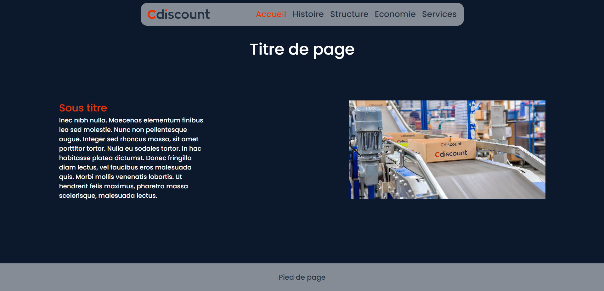

# Cdiscount-SAE5-6

Groupe numéro : 10

Etudiant 1 (référent du groupe) : Lucas Da Silveira (email: lucas.da_silveira@edu.univ-fcomte.fr)

Etudiant 2 : Tom Siouan (email : tom.siouan@edu.univ-fcomte.fr)

Etudiant 3 : Johan Lançon (email : johan.lancon@edu.univ-fcomte.fr)

Etudiant 4 : Mathys Nourry (email : mathys.nourry@edu.univ-fcomte.fr)

## Zoning général

 
    

## Exemple page type

 
    

  
  
## W3C

##Répartition des tâches:

Lucas Da Silveira : Création du diagramme de GANTT, du zoning général, du questionnaire 2, de la page structure, de la partie structure dans le rapport économique , remplissage du readme et aide à la mise en page du rapport.
Tom Siouan : Création du questionnaire 1, des wireframes, de la navbar, de la page d'acceuil, de la page histoire et de la partie histoire du rapport économique.
Johan Lançon : Recherche des informations sur l'entreprise, mise en page du rapport, création de la page services, de la partie service du rapport.
Mathys Nourry : Création de l'accueil, de la navbar, de la page économie, de la partie économie dans le rapport économie, mise en page du rapport économique .
